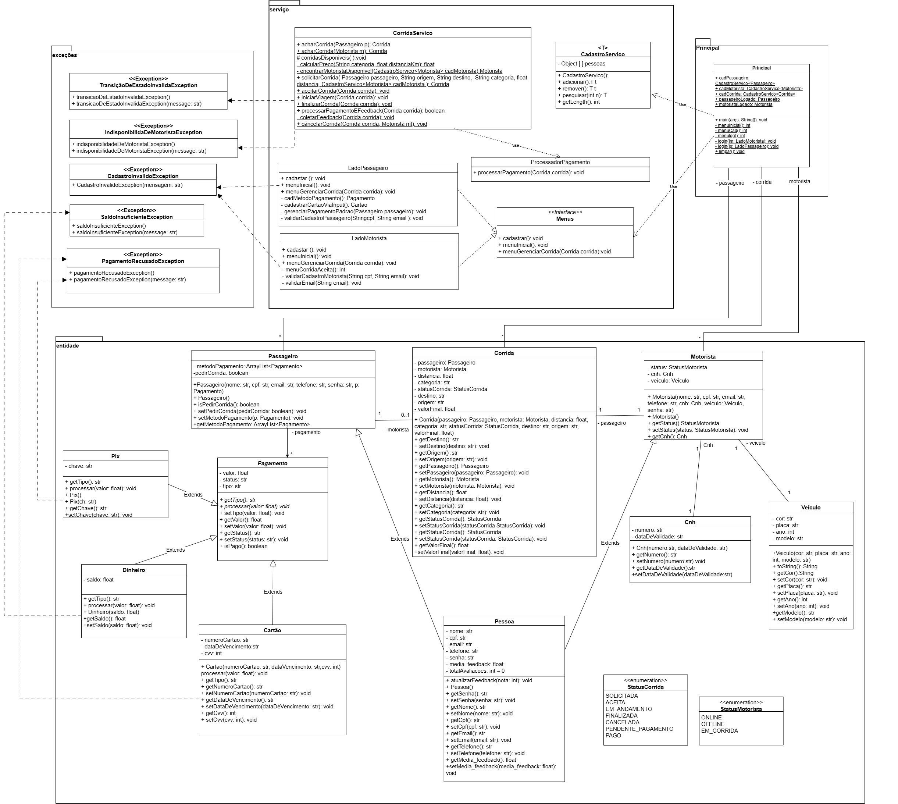

# 🚖 Projeto Uber - Programação Orientada a Objetos

Este projeto é uma simulação de um sistema semelhante ao Uber, desenvolvido em Java como parte da disciplina de Programação Orientada a Objetos.

---

## 📌 Diagrama UML do Sistema

> Representação das classes, relacionamentos e herança do sistema.

---

## 🛠️ Tecnologias Utilizadas
- **Java**
- Programação Orientada a Objetos (POO)
- Exceções personalizadas
- UML

---

## 👩‍💻 Autora
**Letícia DSP**

💡 Repositório criado para entrega de trabalho acadêmico — UnB
